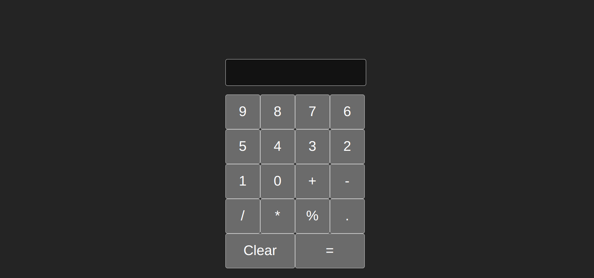

# Calculator App

This project is a simple calculator application created as part of a frontend internship at CodeAlpha. It is built using React and Vite, providing basic arithmetic operations in a clean and intuitive interface.

## Table of Contents

- [Calculator App](#calculator-app)
  - [Table of Contents](#table-of-contents)
  - [Demo](#demo)
  - [Features](#features)
  - [Installation](#installation)
  - [Usage](#usage)
  - [Code Overview](#code-overview)
    - [React Component](#react-component)
    - [CSS](#css)
  - [How it looks like](#how-it-looks-like)
  - [License](#license)

## Demo

You can view a live demo of the calculator app [here](https://calculator-3892g7lcc-tracyk10s-projects.vercel.app/).

## Features

- Simple and intuitive user interface.
- Basic arithmetic operations: addition, subtraction, multiplication, division, and modulus.
- Clear button to reset the input.
- Responsive design.

## Installation

1. Clone the repository:
    ```bash
    git clone https://github.com/TracyK10/CodeAlpha_frontend_internship_tasks.git
    ```
2. Navigate to the project directory:
    ```bash
    cd CodeAlpha_frontend_internship_tasks/calculator-app
    ```
3. Install the dependencies:
    ```bash
    npm install
    ```
4. Start the development server:
    ```bash
    npm run dev
    ```

## Usage

1. Open your browser and go to `http://localhost:3000` to view the calculator app.

## Code Overview

### React Component

The main component of the application, `App`, uses React hooks to manage state and handle user interactions.

```javascript
import { useState } from 'react'
import './App.css'

function App() {
 const [result, setResult] = useState('')

 function clickHandler(event){
    setResult(result.concat(event.target.value))
 }

 function clearDisplay(){
    setResult('')
 }

 function calculateValue(){
  setResult(eval(result).toString())
 }

  return (
    <div className='calc'>
      <input type="text" name="input" id="input" value={result} />
      <input type="button" value="9" className="button" onClick={clickHandler}/>
      <input type="button" value="8" className="button" onClick={clickHandler}/>
      <input type="button" value="7" className="button" onClick={clickHandler}/>
      <input type="button" value="6" className="button" onClick={clickHandler}/>
      <input type="button" value="5" className="button" onClick={clickHandler}/>
      <input type="button" value="4" className="button" onClick={clickHandler}/>
      <input type="button" value="3" className="button" onClick={clickHandler}/>
      <input type="button" value="2" className="button" onClick={clickHandler}/>
      <input type="button" value="1" className="button" onClick={clickHandler}/>
      <input type="button" value="0" className="button" onClick={clickHandler}/>
      <input type="button" value="+" className="button" onClick={clickHandler}/>
      <input type="button" value="-" className="button" onClick={clickHandler}/>
      <input type="button" value="/" className="button" onClick={clickHandler}/>
      <input type="button" value="*" className="button" onClick={clickHandler}/>
      <input type="button" value="%" className="button" onClick={clickHandler}/>
      <input type="button" value="." className="button" onClick={clickHandler}/>
      <input type="button" value="Clear" className="button button1" onClick={clearDisplay}/>
      <input type="button" value="=" className="button button1" onClick={calculateValue}/>
    </div>
  )
}

export default App
```

### CSS

The CSS file provides styling for the calculator, ensuring a clean and responsive design.

```css
.calc {
  display: flex;
  flex-direction: column;
  align-items: center;
  margin-top: 50px;
}

input[type="text"] {
  width: 260px;
  height: 40px;
  margin-bottom: 10px;
  text-align: right;
  padding: 5px;
  font-size: 20px;
}

.button {
  width: 60px;
  height: 60px;
  margin: 5px;
  font-size: 20px;
}

.button1 {
  width: 130px;
}

input[type="button"]:hover {
  background-color: #f0f0f0;
}
```

## How it looks like


## License

This project is open-sourced under the MIT License. For more details, refer to the [LICENSE](LICENSE) file.
