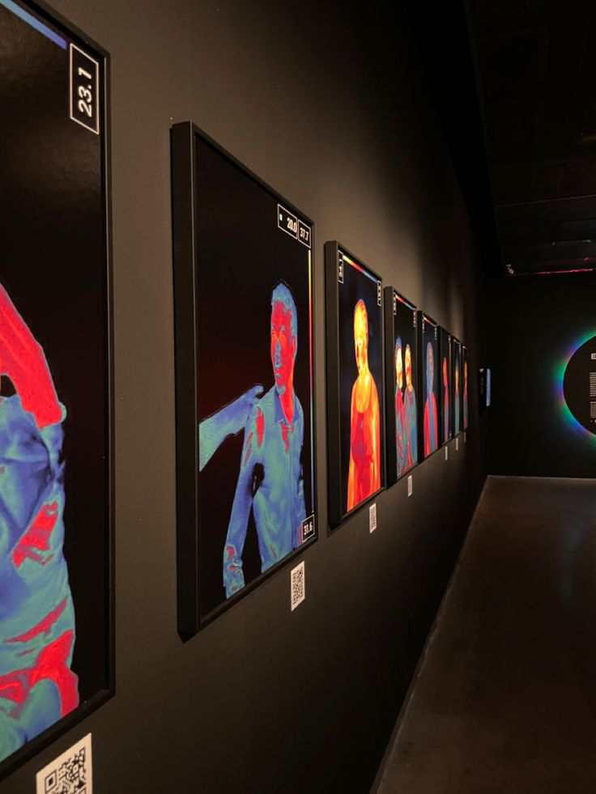

# Image Gallery

This project is a simple image gallery created as part of a frontend internship at CodeAlpha. It showcases a collection of images displayed in a responsive grid layout. The gallery is built using HTML and CSS, with a focus on modern web design practices and responsiveness.

## Table of Contents

- [Demo](#demo)
- [Features](#features)
- [Installation](#installation)
- [Usage](#usage)
- [License](#license)

## Demo

You can view a live demo of the image gallery [here](https://github.com/TracyK10/CodeAlpha_frontend_internship_tasks/tree/main/image-gallery).

## Features

- Responsive design using CSS Grid.
- Image hover effects with smooth transitions.
- Fixed footer with author and project information.
- Clean and modern design.

## Installation

1. Clone the repository:
    ```bash
    git clone https://github.com/TracyK10/CodeAlpha_frontend_internship_tasks.git
    ```
2. Navigate to the project directory:
    ```bash
    cd CodeAlpha_frontend_internship_tasks/image-gallery
    ```

## Usage

1. Open `index.html` in your preferred web browser to view the image gallery.

## Code Overview

### HTML

The HTML structure includes a header, main section with the image gallery, and a footer. The images are sourced from the `images` directory.

```html
<!DOCTYPE html>
<html lang="en">
<head>
    <meta charset="UTF-8">
    <meta name="viewport" content="width=device-width, initial-scale=1.0">
    <title>Image Gallery</title>
    <link rel="stylesheet" href="styles.css">
</head>
<body>
    <header>
        <h1>Image Gallery</h1>
    </header>
    <main>
        <section>
            <div class="image-gallery">
                
                
                
                
                
                
                
                
                
                
                
                
            </div>
        </section>
    </main>
    <footer>
        <p>Made by <a href="https://github.com/TracyK10">Tracy</a> 🌸 which is open-sourced on <a href="https://github.com/TracyK10/CodeAlpha_frontend_internship_tasks/tree/main/image-gallery">Github</a> 🖥</p>
    </footer>
</body>
</html>
```

### CSS

The CSS provides styles for the layout, including a responsive grid, image hover effects, and overall styling for the gallery.

```css
body {
    font-family: Arial, sans-serif;
    margin: 0;
    padding: 0;
    background-color: #f4f4f4;
    text-align: center;
}

header {
    background-color: #333;
    color: #fff;
    padding: 1rem;
    text-align: center;
}

.image-gallery {
    display: grid;
    grid-template-columns: repeat(auto-fill, minmax(300px, 1fr));
    grid-gap: 0.5rem;
    margin: 0 auto;
    padding: 1rem;
    margin-left: 2rem;
}

img {
    width: 100%;
    height: auto;
    max-width: 300px;
    max-height: 300px;
    object-fit: cover;
    border-radius: 5px;
    box-shadow: 0 0 10px rgba(0, 0, 0, 0.4);
}

img:hover {
    transform: scale(1.1);
    transition: transform 0.5s;
}

a {
    color: #fff;
}

footer {
    background-color: #333;
    color: #fff;
    text-align: center;
    padding: 1rem;
    position: fixed;
    bottom: 0;
    width: 100%;
}
```

## How it looks like


## License

This project is open-sourced under the MIT License. For more details, refer to the [LICENSE](LICENSE) file.

