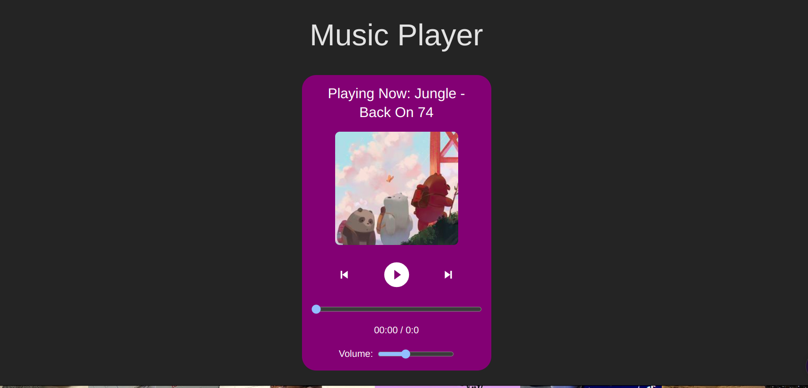

# Music Player App

This project is a Music Player application created as part of a frontend internship at CodeAlpha. It is built using React and utilizes the `use-sound` library for playing audio. The app offers a sleek interface to play and manage your favorite track.

## Table of Contents

- [Music Player App](#music-player-app)
  - [Table of Contents](#table-of-contents)
  - [Demo](#demo)
  - [Features](#features)
  - [Installation](#installation)
  - [Usage](#usage)
  - [Code Overview](#code-overview)
    - [React Component](#react-component)
    - [CSS](#css)
  - [How it looks like](#how-it-looks-like)
  - [License](#license)

## Demo

You can view a live demo of the music player app [here](https://music-player-ten-delta.vercel.app/).

## Features

- Play and pause audio track.
- Display current track information (title, artist, album art).
- Volume control.
- Seek functionality to navigate through the track.
- Responsive design for various screen sizes.

## Installation

1. Clone the repository:
    ```bash
    git clone https://github.com/TracyK10/CodeAlpha_frontend_internship_tasks.git
    ```
2. Navigate to the project directory:
    ```bash
    cd CodeAlpha_frontend_internship_tasks/music-player
    ```
3. Install the dependencies:
    ```bash
    npm install
    ```
4. Start the development server:
    ```bash
    npm run dev
    ```

## Usage

1. Open your browser and go to `http://localhost:3000` to view the music player app.
2. Use the controls to play, pause, adjust volume, and seek within the track.

## Code Overview

### React Component

The main component of the application, `Player`, uses React hooks to manage state and handle user interactions for playing and managing the audio track.

```javascript
import { useEffect, useState } from "react";
import useSound from "use-sound";
import { AiFillPlayCircle, AiFillPauseCircle } from "react-icons/ai";
import { BiSkipNext, BiSkipPrevious } from "react-icons/bi";
import { IconContext } from "react-icons";
import music from "../assets/Jungle - Back On 74 (Official Video) (320).mp3";

function Player() {
  const [playing, setPlaying] = useState(false);
  const [volume, setVolume] = useState(0.5);
  const [play, { stop, sound }] = useSound(music, { volume });
  const [currentTime, setCurrentTime] = useState({
    min: "0",
    sec: "0",
  });
  const [totalTime, setTotalTime] = useState({
    min: "0",
    sec: "0",
  });
  const [seconds, setSeconds] = useState(0);

  useEffect(() => {
    if (sound) {
      sound.on("load", () => {
        const duration = sound.duration();
        const totalSeconds = duration;
        const min = Math.floor(totalSeconds / 60);
        const sec = Math.floor(totalSeconds % 60);
        setTotalTime({
          min: min.toString().padStart(2, "0"),
          sec: sec.toString().padStart(2, "0"),
        });
      });
    }
  }, [sound]);

  useEffect(() => {
    const interval = setInterval(() => {
      if (playing && sound) {
        setSeconds((seconds) => seconds + 1);
        const min = Math.floor(sound.seek() / 60);
        const sec = Math.floor(sound.seek() % 60);
        setCurrentTime({
          min: min.toString().padStart(2, "0"),
          sec: sec.toString().padStart(2, "0"),
        });
      }
    }, 1000);

    return () => clearInterval(interval);
  }, [playing, sound]);

  function playingButton() {
    setPlaying(!playing);
    if (!playing) {
      play();
    } else {
      stop();
    }
  }

  function handleSeek(event) {
    const seekTime = event.target.value;
    sound.seek(seekTime);
    setSeconds(seekTime);
    const min = Math.floor(seekTime / 60);
    const sec = Math.floor(seekTime % 60);
    setCurrentTime({
      min: min.toString().padStart(2, "0"),
      sec: sec.toString().padStart(2, "0"),
    });
  }

  function handleVolumeChange(event) {
    setVolume(event.target.value);
  }

  return (
    <div className="text-center bg-fuchsia-900 p-4 rounded-3xl w-80">
      <h2 className="text-2xl mb-4 text-white">
        Playing Now: Jungle - Back On 74
      </h2>
      
      <div className="flex justify-center items-center space-x-4">
        <IconContext.Provider value={{ color: "white", size: "2em" }}>
          <BiSkipPrevious className="cursor-pointer" />
        </IconContext.Provider>
        <button onClick={playingButton} className="focus:outline-none ">
          <IconContext.Provider value={{ color: "white", size: "2em" }}>
            {playing ? (
              <AiFillPauseCircle className="text-4xl text-white h-12" />
            ) : (
              <AiFillPlayCircle className="text-4xl text-white h-12" />
            )}
          </IconContext.Provider>
        </button>
        <IconContext.Provider value={{ color: "white", size: "2em" }}>
          <BiSkipNext className="cursor-pointer h-12" />
        </IconContext.Provider>
      </div>
      <div className="flex justify-center items-center mt-4">
        <input
          type="range"
          min="0"
          max={sound ? sound.duration() : 0}
          value={seconds}
          onChange={handleSeek}
          className="w-full"
        />
      </div>
      <div className="text-white mt-4">
        {currentTime.min}:{currentTime.sec} / {totalTime.min}:{totalTime.sec}
      </div>
      <div className="flex justify-center items-center mt-4">
        <label htmlFor="volume" className="text-white mr-2">Volume:</label>
        <input
          id="volume"
          type="range"
          min="0"
          max="1"
          step="0.01"
          value={volume}
          onChange={handleVolumeChange}
        />
      </div>
    </div>
  );
}

export default Player;
```

### CSS

The CSS file provides styling for the music player, ensuring a clean and responsive design.

```css
.text-center {
  text-align: center;
}
.bg-fuchsia-900 {
  background-color: #7c3aed;
}
.p-4 {
  padding: 1rem;
}
.rounded-3xl {
  border-radius: 1.5rem;
}
.w-80 {
  width: 20rem;
}
.mb-4 {
  margin-bottom: 1rem;
}
.mx-auto {
  margin-left: auto;
  margin-right: auto;
}
.h-48 {
  height: 12rem;
}
.w-52 {
  width: 13rem;
}
.object-cover {
  object-fit: cover;
}
.rounded-lg {
  border-radius: 0.5rem;
}
.flex {
  display: flex;
}
.justify-center {
  justify-content: center;
}
.items-center {
  align-items: center;
}
.space-x-4 {
  gap: 1rem;
}
.cursor-pointer {
  cursor: pointer;
}
.focus\:outline-none {
  outline: none;
}
.mt-4 {
  margin-top: 1rem;
}
.w-full {
  width: 100%;
}
.text-white {
  color: white;
}
```

## How it looks like


## License

This project is open-sourced under the MIT License. For more details, refer to the [LICENSE](LICENSE) file.
